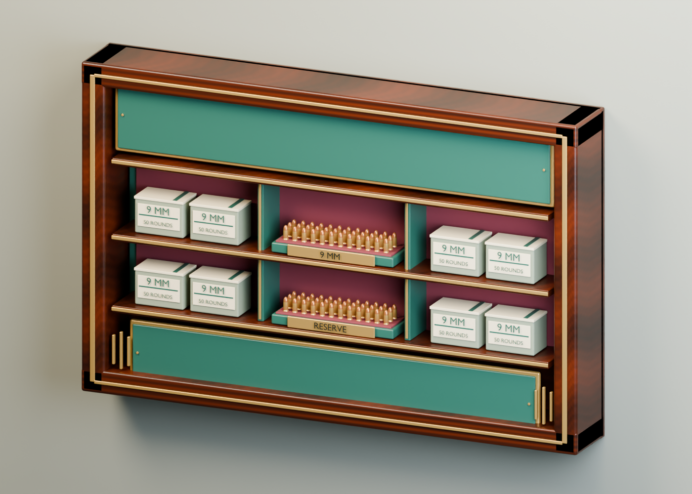

# Casino ammunition wall cabinet

Original Blender asset for the south-wall pistol ammunition purchase. Walnut cabinetry, racing green enamel, oxblood felt and antique brass match the surrounding casino. Eight folded ammunition cartons have modeled lid seams, paper labels and caliber lettering; 72 individual rounds have rimmed brass cases, extractor grooves and copper round noses. Brass shelf reveals, small compartment plates, screws and corner fluting finish the cabinet. No third-party models, fonts or textures were downloaded.



## Deliverables

- `assets/source/pistol-ammo-display.blend`: editable named components, packed original walnut image, studio wall, lights and camera.
- `public/models/pistol-ammo-display.glb`: static runtime model with eight material batches and one embedded 512-square walnut texture.
- `tools/ammo-assets/generate_ammo_blender.py`: deterministic original authoring, export and preview generation.
- `tools/ammo-assets/validate_ammo.py`: independent geometry, normals, winding, embedded image, budget and wall-origin audit.
- `tools/ammo-assets/audit_orientation.mjs`: actual Babylon import and bounding-box check.
- `asset-manifest.json`, `validation-report.json`, `babylon-orientation-audit.json`: provenance and measured results.

## Mounting and live labels

Dimensions are **2.50 m wide × 1.60 m high × 0.339 m deep**. The origin is centered vertically and horizontally on the flat back mounting face. Blender is Z-up with front −Y and back Y=0. The export is glTF Y-up with front +Z and back Z=0. With the existing Babylon left-handed scene and the **retained loader root**, the front also points toward **Babylon +Z**. Use zero placement yaw on the south wall. The source is intentionally centered rather than floor-based.

Mount at the existing purchase X, Y=1.5 and the south wall Z plus 0.29. This gives a vertical range of 0.7–2.3 m and clears the wall pilasters. Gameplay purchase anchors and prices remain controlled by the existing game.

The green header and price cartouches remain blank in the GLB so the renderer can supply legible labels at game resolution:

| Label | Local center Y | Local front Z | Width | Height |
| --- | ---: | ---: | ---: | ---: |
| Pistol ammunition | +0.55 | +0.28 | 2.08 | 0.30 |
| Refill price | −0.595 | +0.28 | 1.90 | 0.24 |

Place the live label surfaces relative to the mounting origin. The cartouches are recessed; the front of their green enamel lies at Z=0.2745. The wood frame extends to Z=0.339. Rendering text at Z=0.28 seats it on the green panels without contacting the frame.

The geometry audit checks finite accessors, normalized normals, index bounds, zero-area triangles, winding, eight material batches, image embedding, dimensions and mounting origin. The runtime audit loads the actual exported bytes through Babylon and verifies unrotated bounds and front direction. The preview was visually inspected in Blender. Runtime placement and lighting are verified separately in the map polish playtest.

Runtime close inspection confirmed the cabinet's lettering is unmirrored. Carton graphics use a larger `9 MM` and a single `50 ROUNDS` line; the tray plates read `9 MM` and `RESERVE`. These replace the original small three-line stock labels, which undersampled at ordinary play distance. Letter faces also have more separation from their backing surfaces.

## Regenerate

```sh
/Applications/Blender.app/Contents/MacOS/Blender --background --factory-startup --threads 8 --python tools/ammo-assets/generate_ammo_blender.py
python3 tools/ammo-assets/validate_ammo.py
node tools/ammo-assets/audit_orientation.mjs
```

The Python audit requires NumPy and Pillow. Add `-- --no-render` to the Blender command to skip the 32-sample Cycles preview. On this machine Blender's graphics initialization needs local execution outside the restricted sandbox. Temporary export meshes are removed before the native source is saved. Export cleanup removes collapsed glyph triangles and applies each material batch's transforms to prevent inflated runtime bounds.
