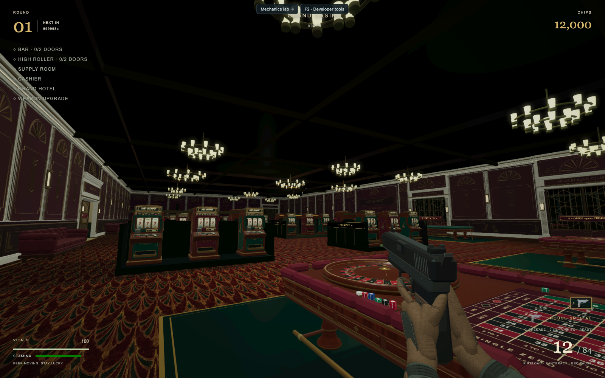
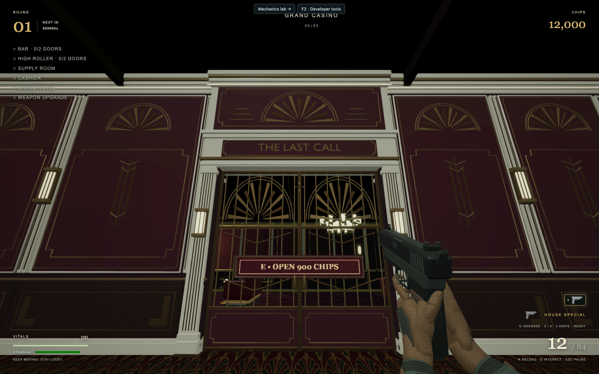
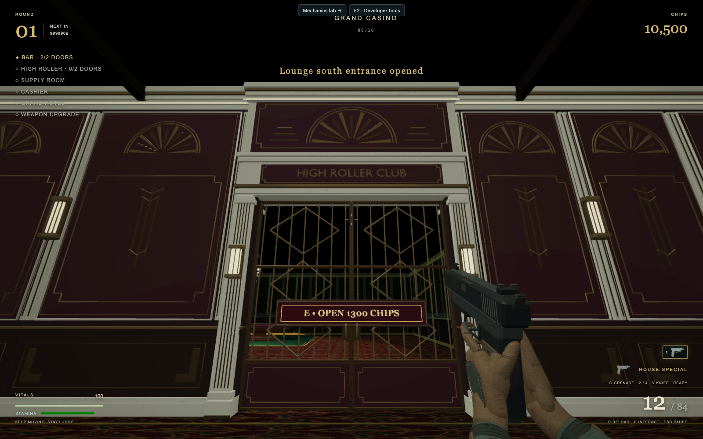
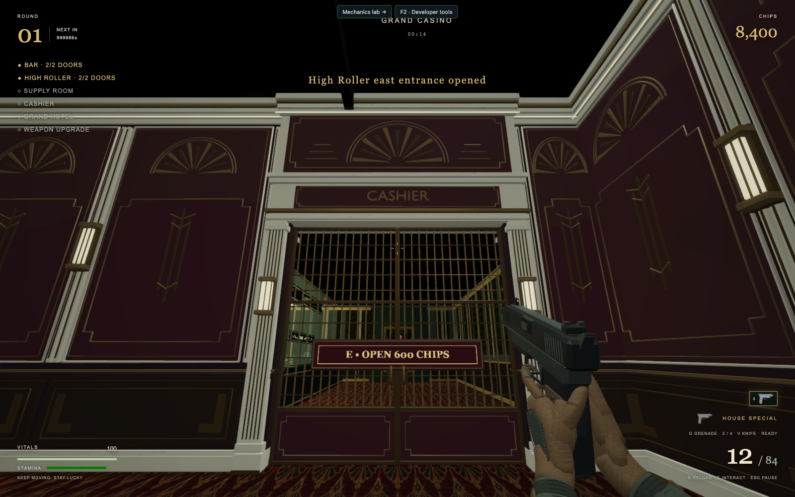

# Casino architecture playtest — September 30, 2026

Verified in the isolated `codex/hotel-gate-walls` worktree at
`http://127.0.0.1:5176/?playtest=1`, using desktop Chrome, Metal WebGL on Apple M4,
and a 1600 × 1000 viewport. These are screenshots of the rendered game, not
Blender renders. `browser-validation.json` records the final interaction checks.

## Visual walkthrough

Inspected all four room-wide diagonal views, the south feature wall, Grand Hotel,
each of the five new room gates closed and open, and their reverse faces.
All main-room walls now use the same oxblood, ivory, walnut and brass family.
Cornices reach the ceiling and turn the corners; door upper panels close the
previous bare zones. Casings meet the adjacent panels, with no exterior holes.

The three gate designs share proportions and materials while remaining distinct:

Reverse headers read GRAND CASINO and fit beneath the adjoining ceilings.
The front and reverse price plaques are legible and disappear with the gate.
The ammunition cabinet and shotgun display remain visible and show their
interaction prompts in front of the deeper cladding.

Fine raised trim initially broke into unstable fragments in distant views.
Four-sample coverage antialiasing, capped to the device's supported sample count,
is now applied to the scene-color/SSAO input and finish pipeline. Final wide
views were inspected again with the existing lighting, bloom and tone mapping.
The normal near plane and ambient-occlusion configuration are retained.

## Interaction checks

- Loaded all 18 placed architecture roots and hid all 18 fixed fallbacks.
- Purchased lounge, shortcut, VIP, VIP exit and Cashier in sequence, charging
  exactly 900, 600, 1,300, 800 and 600 chips. Each gate opens independently.
- For every gate, the real simulation movement function stops the player while
  closed, traverses the opening after purchase, and returns through the same
  opening. The fixed surround stays visible and both price labels disappear.
- Traversed the main-room perimeter through (-31,-17), (26,-17), (26,8.5),
  (-31,8.5), and back using collision-aware movement. The east route passes
  outside existing table furniture. No wall or casing snags occurred.
- Held W through actual browser keyboard input; the player moved from Z=-10 to
  approximately Z=-6.16 down the central aisle.
- A separate pointer-locked combat check used real mouse input against a seeded
  standard enemy. Four pistol rounds were spent (12 to 8), the enemy died,
  and R restored the magazine to 12 while reducing reserve from 84 to 80.
- Forced the final Cashier gate asset request to fail. All partial architecture
  roots were disposed, all fixed fallbacks remained enabled, and the Cashier
  purchase still succeeded. A separate visual check confirms the thinner
  fallback door leaves both inset price planes unobscured.
- No uncaught page errors occurred in the final normal-load browser checks.

## Automated checks

- Full gameplay suite: **278 passed, 0 failed**. Run because this pass changes
  shared main-room geometry as well as rendering.
- Actual GLB perimeter/portal audit: **4,249 samples passed**, including doorway
  clearances from both sides, upper-wall closure, ceiling contact and budgets.
- Hotel facade GLB audit: passed after rebuilding the shared sconces and coves.
- TypeScript, focused ESLint, and Git whitespace checks: passed.

The Blender audit caught a rear nameplate transform being applied before its
world matrix updated. The generator now updates transforms before mirroring
reverse lettering; the corrected exports passed the below-floor and rear-face
checks and were visually inspected in game.

To inspect manually, open the preview and use F2 → Seed run for chips and a quiet
walkthrough. Approach either lounge gate, either High Roller gate, or Cashier and
press E. Look back from the adjoining room to inspect the return frame. Use a
normal new run for combat. The remote supply-room architecture is outside this
main-casino pass; room furniture and gameplay economy retain their existing roles.
