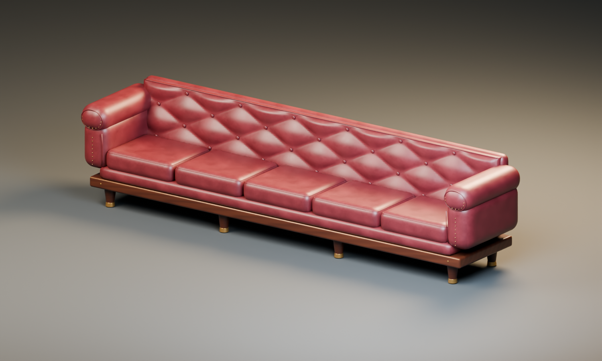
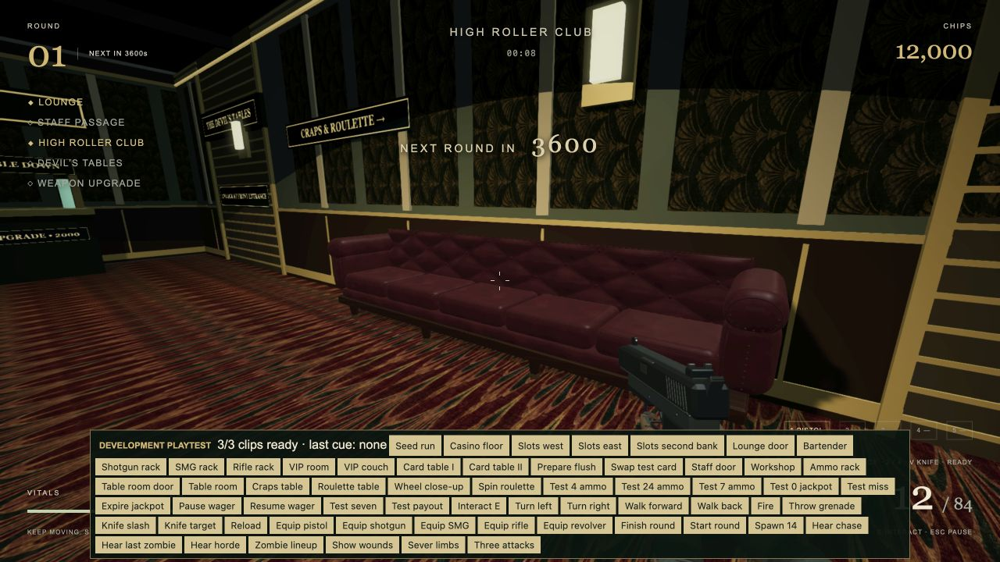
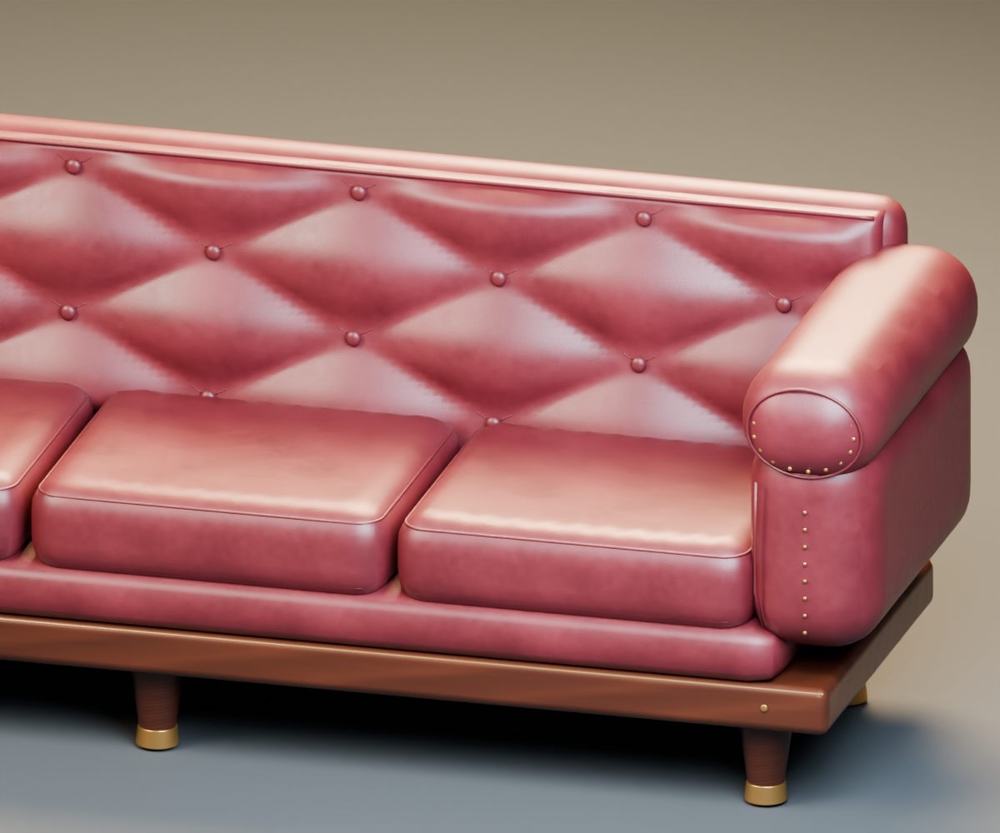

# High Roller Club couch

Original five-seat oxblood leather banquette, modeled and rendered in Blender 5.2.2 LTS for the room containing the two flush card games. The source geometry and procedural textures were authored specifically for Last Jackpot; no downloaded models, photographs, or third-party texture assets are used.



## Delivered files

- `assets/source/vip-couch.blend`: editable named upholstery, seams, buttons, arm rolls, joinery, legs, and studio setup. All four texture images are packed.
- `public/models/vip-couch.glb`: self-contained browser asset with embedded PBR maps and six material batches.
- `assets/source/couch/`: original leather base color, tangent normal, roughness, and walnut maps.
- `tools/couch-assets/`: deterministic texture generator, Blender geometry/export/render generator, and independent GLB validator.
- `couch-blender-preview.png`, `couch-blender-detail.png`, `couch-in-game.png`: studio and runtime visual checks.
- `asset-manifest.json`, `validation-report.json`: provenance, texture metadata, and geometry audit.

## Construction and placement

The back has sculpted diamond quilting with recessed covered buttons. Five separate seat cushions include shallow compression, edge wrinkles, upper/lower leather piping, and modeled front saddle stitches. Rounded arm rolls have inset welting and brass nailheads. A walnut plinth and eight tapered wooden legs have brass reveals, collars, and floor-contact ferrules. Seam geometry remains distinct and editable in the Blender source; the export merges parts by material to limit draw calls.

Runtime dimensions are approximately **4.956 m wide × 1.195 m high × 1.063 m deep**. Blender uses Z up and front −Y; glTF uses Y up and front +Z. The pivot is floor-centered. Babylon places it at **(27.35, 0, 1)** with Y rotation **−π/2**, facing west toward the card tables. This fits the existing **1.1 × 5 m** collision rectangle and **1.2 m** cover height. Gameplay dimensions and routes are unchanged.

The final export contains approximately **106,490 triangles**, six materials, six rendered mesh batches, three 1024² leather maps, and one 512² walnut map. The exact counts, dimensions, byte size, and SHA-256 are recorded by the validator. This is one static hero furnishing; no sustained frame-time benchmark is claimed.

## Regenerate

From the project root, with Python, NumPy, Pillow, and Blender installed:

```sh
python3 tools/couch-assets/make_textures.py
/Applications/Blender.app/Contents/MacOS/Blender --background --factory-startup --threads 8 --python tools/couch-assets/generate_couch_blender.py
python3 tools/couch-assets/validate_couch.py
```

The Blender script saves the native file before creating temporary material batches for export. Studio cameras, lights, and floor are excluded from the GLB. Use `-- --no-render` to skip the two Cycles previews. Native images are packed, so the `.blend` can be opened independently of the source PNG directory. CPU rendering uses eight threads, 40 samples, and denoising. On this Mac, Blender's graphics-backend initialization needed local execution outside the restricted sandbox even for CPU rendering.

## Runtime behavior and verification

The renderer keeps the existing block couch as a temporary loading fallback, removing it only after successful import. An unavailable couch asset leaves the fallback playable. Imported meshes receive/cast shadows and use the room's existing lights. Asset disposal follows the other furnishing containers.

Start `npm run dev`, open `/?playtest=1`, click **Seed run**, then **VIP couch**. The viewpoint unlocks the lounge and High Roller room for inspection. The couch was visually checked there for west-facing orientation, scale, floor contact, material response, and placement against the wall. Browser warning/error logs were empty during this check.

The independent validator checks GLB chunks/accessors, finite positions and UVs, unit normals, indices, winding, zero-area triangles, embedded images, material references, world bounds, floor origin, triangle budget, and material batches. The final asset passed with no zero-area triangles or winding mismatches. All 106 existing automated tests, TypeScript checks, and the production build also passed. Build output contains existing framework/bundler advisory warnings.




