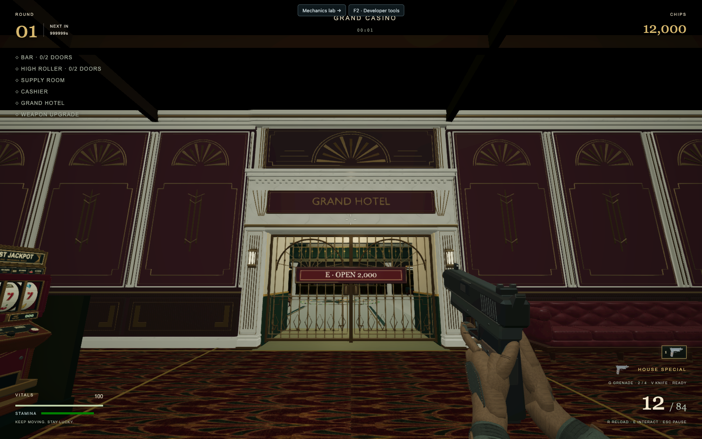

# Hotel facade verification — September 30, 2026

Verified on the isolated `codex/hotel-gate-walls` worktree at
`http://127.0.0.1:5176/?playtest=1`, using desktop Chrome's Metal WebGL renderer
at 1600 × 1000. Screenshots were visually inspected after the final oxblood asset rebuild.
The previous jade preview is superseded by the user-selected oxblood palette.

## Visual and interaction results

- Front view at X=-3, Z=3.9: continuous crown, full-height central panel,
  readable hotel title, aligned nine-bay oxblood wall wings and fitted grille.
  Cast fans, stepped panel borders, geometric pendants and dado inlays are
  readable from the playing approach and in the close-up view.
- Close upward view at X=-3, Z=10.2: no blank green wall above the entrance;
  restrained marble, beveled fan blades and stepped cornice are visible.
  The purchase plaque now matches the oxblood lacquer; champagne brass and
  dark walnut retain different surface finishes.
- Reverse view from X=-3, Z=14 after purchase: clear passage and clean lintel
  underside. The previously coincident underside faces were separated, removing
  visible horizontal banding. Pier reveals also avoid coincident foyer faces.
- East corner at X=22, Z=7: new wall meets the existing perpendicular casino
  wall, with no exterior gap. Unaffected walls retain their existing finish.
- Actual `purchase('hotel')` succeeds and charges exactly 2,000 chips. Gate and
  price label disappear; portal remains visible. Focused gameplay tests also
  verify movement through the purchased gate and correct collision before purchase.
- All 24 exported material meshes load. The procedural facade fallback is hidden.
- Forced failure of the last wall export restores the complete fallback and
  disposes every partial entrance root. No page errors occur in the normal run.
- The gate-only fallback material initially exposed an empty static-batch merge.
  Empty batches are now skipped; the final normal-load and forced-failure
  browser checks both reach a usable game.

`browser-validation.json` records purchase and failure-path observations.
To inspect manually: open Developer tools → Hotel → Hotel entrance in the
playtest, then approach the gate and purchase it with E.

## Automated validation

- `node --experimental-strip-types tools/hotel-assets/validate_entry.mjs`: passed.
  Tests actual GLB bounds, doorway clearance, wall seams, rear surfaces, ceiling
  contact, visibility and geometry/material/download budgets.
- `node --experimental-strip-types --test tests/hotel.test.mjs tests/hotel-gameplay.test.mjs tests/hotel-light-membership.test.mjs`:
  36 tests passed during the initial facade pass on September 29; gameplay
  rules and collision geometry were not changed by this material/detail pass.
- `npm run typecheck`: passed.
- ESLint on the runtime files changed by the oxblood pass: passed.
- `git diff --check`: passed.

This is a visual entrance/north-wall change. No full-suite or production-build
claim is made; gameplay geometry, purchase rules and other rooms were not changed.
