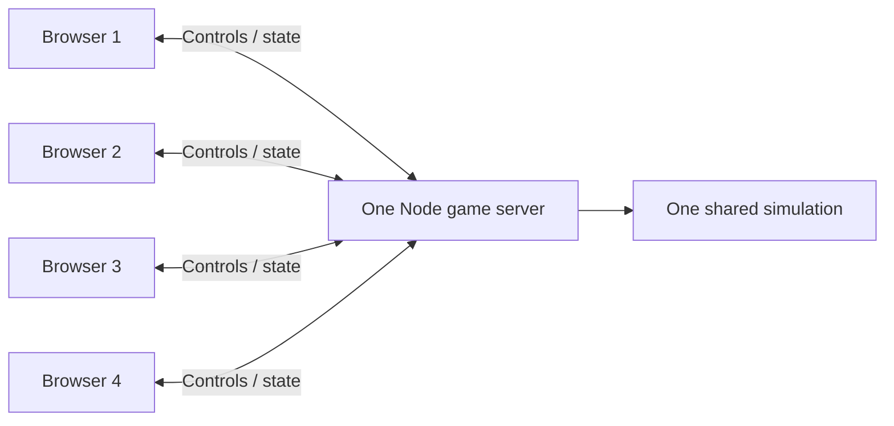

# Private four-player co-op implementation plan

> **Implementation now exists as a first playable on `codex/four-player-coop`. Read [current implementation, setup, and limitations](implementation.md) for the actual status.** This README and the gameplay, networking, and validation documents below are the earlier design plan. Some proposed systems remain unimplemented, and the current transport uses plain `ws` rather than Colyseus. Planned release gates must not be read as completed checks.

## Objective and scope

Let up to four friends play Last Jackpot together in one private, server-hosted game. One person creates the lobby, shares a short join code, and starts when the party is ready. Everyone sees the same zombies, open doors, wave progression, and world events. Controls should remain responsive under ordinary home-internet latency.

The first release supports one active room on one server, temporary player names, personal equipment and chips, shared world progression, reconnection, and a complete co-op run. The existing offline solo mode remains available. Accounts, voice chat, public matchmaking, saved campaigns, multiple regions, competitive anti-cheat, player-versus-player combat, and new bespoke character art are outside this release.

This plan uses explicit proposed defaults so implementation can proceed without repeatedly stopping for minor decisions. They are design recommendations, not preferences already approved by the user.

## Planning worktree and source baseline (historical)

| Item | Value |
| --- | --- |
| Planning branch | `codex/four-player-coop-plan` |
| Worktree | `/Users/alexsantarelli/Documents/ChatGPT/zombie test game/four-player-coop-plan` |
| Base commit | `2160dc296bbe3d8c6e8ad3277f5ee8f3d282ec3a` |
| Base description | Merge pull request #10 from `codex/hotel-lobby-prototype` |
| Additional inspected work | Uncommitted hotel renovation/mystery changes in the sibling `hotel-lobby-prototype` worktree |

The planning branch added only documents. At that time, uncommitted hotel changes and zombie-model work had not been copied, committed, or merged into that branch. The mystery-specific rules below described integration with pending work absent from that planning base. The later implementation started from a newer main revision; see its [actual baseline and integration notes](implementation.md). Source references below belong to the original inspection and need rechecking against newer code, especially collision geometry, hotel rewards, menus, and the renderer.

## Read the detailed specifications

- [Gameplay rules and state ownership](gameplay-rules.md): individual versus shared state, every existing interaction, death, respawn, AI, and reward policies.
- [Networking and hosting](network-and-hosting.md): server authority, join codes, input delivery, movement smoothing, reconnects, hosting boundaries, and failure handling.
- [Validation and release gates](validation-plan.md): simulation races, real transport tests, four-person playtests, performance hypotheses, and ship criteria.

## Proposed player experience

1. The landing screen offers **Solo**, **Create private game** for the room creator, and **Join with code**. The private hosting setup controls who can create the single room.
2. Joining requires a room code and display name. The lobby shows up to four named/color-coded slots, connection status, readiness, and the creator's Start control. The code admits a new player; a private session credential restores an existing player.
3. Players start together with the existing initial loadout and chips. They purchase their own guns and perks; buying a door opens it for everyone. Teammates have simple readable bodies, nameplates, and health indicators.
4. Escape, the shop, poker, and documents affect that player's controls/UI. The multiplayer world continues. Solo retains its existing pause behavior.
5. Death moves the player to spectating until the next round. A team wipe ends the run. Late arrivals also spectate until the next round. Friendly fire and teammate collision are disabled; self-inflicted grenade damage remains.
6. A temporary disconnect reserves the player's identity and exact loadout. Rejoining does not reset health, refill weapons, or reissue rewards. The detailed lifecycle specifies a proposed 30-second grace and 120-second entirely-empty room expiry.
7. The creator can start a rematch after results. Creator control can transfer to another connected player; simulation always runs on the dedicated server.

## Architecture and existing code

Use a persistent Node process with Colyseus for room transport and state synchronization, subject to a short compatibility spike. Browsers keep rendering with Babylon.js. The current Sites frontend can stay where it is and connect to the separate game endpoint; "one server" means one authoritative game server, without requiring a second game host on someone's computer. The server does not render frames or require a GPU. Provider-specific capabilities and limitations are documented in the networking specification.

| Current area | Evidence in this base | Intended change |
| --- | --- | --- |
| `lib/game/simulation.ts` | `Simulation` at line 459 holds one player's state alongside world state | Separate `PlayerState`, `WorldState`, and player-scoped commands; retain one shared rules implementation |
| `lib/game/runtime.ts` | `frame` at line 742 drives the fixed 60 Hz simulation and consumes events | Introduce local/network session adapters; input, prediction, UI, and audio remain browser responsibilities |
| `lib/game/renderer.ts` | `update(sim: Simulation, dt)` at line 1937 reads mutable simulation directly | Render a read-only view containing local-player presentation and interpolated remote actors |
| `lib/game/world.ts` | `Navigation.update(target)` at line 364 assumes one target | Support reachable targets for several players and reuse collision/movement math on both sides |
| `lib/game/hotel-gameplay.ts`, `poker.ts` | Stateful challenges and casino rewards assume one recipient | Add ownership, eligibility, atomic claims, and shared interaction policies |
| `app/page.tsx` | Constructs `GameRuntime` and shows solo HUD/menus | Add lobby, joining/error states, teammate HUD, spectating, reconnect, and room results |
| `vite.config.ts`, `.openai/hosting.json` | Existing frontend runs through the Sites/Worker build | Keep frontend deployment separate from the persistent simulation process |

Proposed new modules are `lib/game/state.ts`, `lib/game/commands.ts`, `lib/game/movement.ts`, `lib/game/render-state.ts`, `lib/game/session.ts`, `lib/net/protocol.ts`, `lib/net/network-session.ts`, `lib/net/prediction.ts`, and `lib/game/remote-players.ts`, plus a `server/` package for the room, creation/join API, lifecycle, and operational endpoints. Names can change during the spike; the ownership boundaries should hold.

The server needs its own package/build configuration and Node-only TypeScript types. Exclude it from the frontend TypeScript project or use explicit project references. Do not import browser rendering/audio modules into the server bundle. Compute presentation values currently exposed through `Simulation` methods in the render-view adapter. A temporary solo compatibility facade can preserve existing tests during extraction, but do not maintain two divergent gameplay implementations.

## Delivery sequence

All durations below are engineering-effort estimates for one experienced developer, including relevant verification. They are not measured throughput or elapsed-time commitments.

| Milestone | Deliverable and dependency | Exit gate | Effort |
| --- | --- | --- | --- |
| P0: establish baseline and prove transport | Record integrated source revisions; validate Colyseus package/runtime compatibility, room creation/join, deploy shape, and prediction approach | Two browser clients exchange controlled state through a real local server; ADR records versions and decisions | 1–2 days |
| P1: shared multi-player simulation | Split player/world state; player-owned actions, rewards and events; preserve offline solo; multi-target AI and safe spawns | Four simulated players affect one world; solo behavior passes relevant regressions; purchases/kills cannot award twice | 2–4 days |
| P2: room and client integration | Server tick loop, identity/session handling, private codes, lobby, version checks, snapshots and command results | Four clients join the same room, fifth is rejected, server validates state-changing actions, doors and waves agree | 2–3 days |
| P3: playable combat slice | Movement prediction/reconciliation, remote interpolation, teammate models, positional effects, death/spectating/respawn | Four people complete three waves; delayed-network controls remain usable; no duplicate shots/rewards or stuck input | 3–5 days |
| P4: complete existing interactions and recovery | Casino/hotel policies, local menus, late join, reconnect, creator transfer, rematch, balance adjustments | Feature matrix passes, including simultaneous interactions and disconnection during rewards | 3–5 days |
| P5: hosted verification and polish | Dedicated hosting configuration, diagnostics, graceful maintenance behavior, real-device playtest and soak | Release gates in the validation specification pass; failure recovery is understandable to players | 2–4 days |

Total: approximately **13–23 focused developer days**, plus **3–5 days contingency** for network feel, art compatibility, and hotel integration. Budget about **3–6 working weeks** for dependable private co-op. Aim for a core playable around the second week, but the P0–P3 ranges can extend into a third. More detailed inspection makes that estimate safer than treating the initial 1–2-week rough-playable estimate as a promise.

P1 and shared render-view preparation can overlap after interfaces are agreed. Lobby/UI and simple teammate art can also overlap. Simulation ownership must settle before combat synchronization, and transport must work before latency tuning. Additional parallel coding cannot replace coordinated four-person playtesting.

## Decisions, risks, and cost control

The gameplay specification makes personal chips, shared unlocks, no friendly fire, next-wave respawn, and simple teammate models the default. Changes to revive mechanics, pooled money, or casino reward ownership should be decided before P1/P4 respectively. First-person combat quality, packet handling, and single-player regressions are engineering acceptance gates, not optional preference questions.

The main uncertainty is how hits feel at latency after the refactor. Start with authoritative server hit tests and immediate local weapon presentation; test against the stated network profiles. If unacceptable, add bounded historical hit testing in the combat milestone, covering doors and zombie poses as well as positions. Do not silently promise polished high-latency shooting without this gate.

Other material risks are renderer coupling to `Simulation`, navigation with players on different hotel floors, concurrent pending hotel/art changes, and existing pause assumptions hidden in UI/audio. Address them before adding extras. Once correctness works, tune difficulty against party size; the existing enemy cap and single-player economy are not multiplayer performance or balance evidence.

A small persistent CPU server is the initial hosting hypothesis. Actual sizing and monthly cost depend on the measured tick load, bandwidth, provider, and usage. Obtain a current provider quote after P0 and confirm capacity in P5. Do not add a database, Redis, autoscaling, or GPU just for one private room. In-memory sessions end on server restart; keeping campaigns alive through restarts would be additional scope.

## Completion criteria for this planning task

The worktree contains a source-grounded plan, explicit gameplay defaults, a networking/hosting design, ordered milestones, effort ranges, and acceptance criteria. No application source, dependencies, assets, or deployment settings are changed. Documentation checks validate internal links and change scope; they do not establish that multiplayer or any proposed performance target works.
