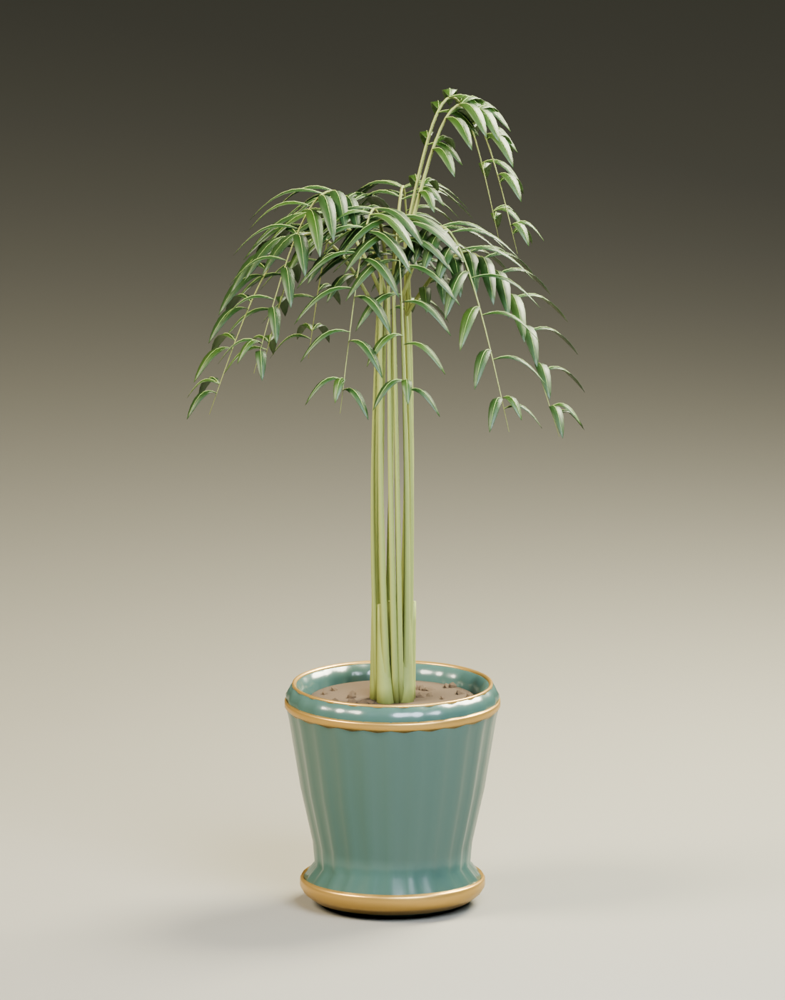

# Casino and hotel feather palm

Original Blender palm and planter to replace the casino's solid oval foliage. Eleven independently curved fronds carry 223 separate lance-shaped leaflets. Each leaflet has real thickness, a folded cross-section, a curved tip and a modeled midrib. Insertions alternate along the rachis, and lengths, angles and heights vary to keep an open, natural silhouette. Individual slender petioles descend into basal sheaths above the soil.

The planter is a fluted dark green ceramic urn with a shaped foot, narrow aged brass reveals and a rolled rim. The opening is hollow, with recessed soil and separate small drainage stones. The model uses opaque geometry throughout; it does not rely on alpha foliage cards.



## Files

- `assets/source/casino-planter.blend`: named editable fronds, leaflets, veins, stems, urn, packed original blade textures, and excluded studio setup.
- `public/models/casino-planter.glb`: runtime asset in seven material batches.
- `tools/planter-assets/generate_planter_blender.py`: original deterministic geometry, image generation, export and render.
- `tools/planter-assets/validate_planter.py`: independent geometry, normals, winding, floor origin, budget and packed-image audit.
- `tools/planter-assets/audit_runtime.mjs`: actual Babylon import check at casino and hotel scales.
- `asset-manifest.json`, `validation-report.json`, `babylon-runtime-audit.json`: provenance and measured results.

No downloaded models or images were used. The two 512-square blade images are generated from mathematical vein and color variation, then packed into the native file and GLB. All leaf shape, thickness and silhouette come from geometry.

## Placement contract

The origin is centered on the planter's floor contact. Blender Z-up exports to glTF Y-up; Babylon imports with Y-up and floor Y=0 when its loader root is retained. Orientation around the vertical axis may be varied for natural planting.

The full plant is **2.35 m high**, inside a **1.20 × 1.20 m** horizontal envelope centered at the origin. The ceramic urn is approximately 0.62 m wide. Hotel placement uses unit scale. Casino placement uses X/Z scale `1 / 1.2` and Y scale `1.8 / 2.35`, fitting the existing 1 m footprint and 1.8 m height. Exact asymmetric foliage bounds appear in the validation report.

The independent audit checks finite accessors, unit normals, valid indices, outward winding, zero-area triangles, runtime bounds, opaque leaf geometry, embedded images and a maximum of seven material batches. A second audit imports the actual GLB through Babylon's loader and checks the floor and bounds at both scales. The studio render was visually inspected; map placement and lighting are checked separately in the browser.

## Regenerate

```sh
/Applications/Blender.app/Contents/MacOS/Blender --background --factory-startup --threads 8 --python tools/planter-assets/generate_planter_blender.py
python3 tools/planter-assets/validate_planter.py
node tools/planter-assets/audit_runtime.mjs
```

The independent Python audit uses NumPy and Pillow. Add `-- --no-render` to skip the 40-sample Cycles studio preview. Blender graphics initialization on this machine requires local execution outside the restricted sandbox. The native file keeps all components separate and editable; temporary export batches bake their transforms to the same floor origin and are removed before saving the source.
