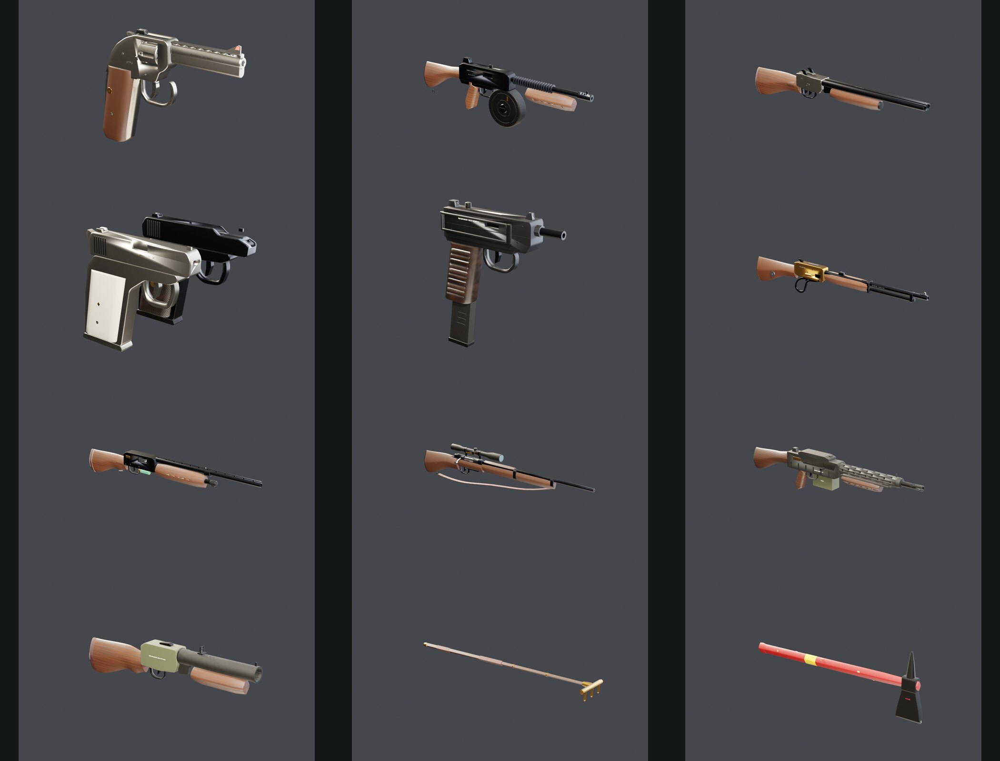
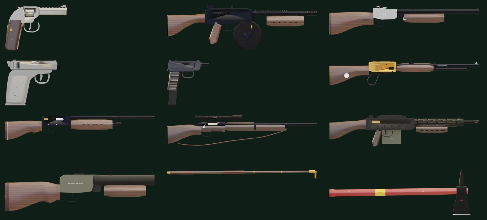

# 1970s Mystery Box arsenal — assets, animation, sound and HUD

Implements [`docs/weapon-spec-1970s.md`](../weapon-spec-1970s.md): the ten Velvet Fortune firearms, the
Stickman craps rake, and the optional Fire Exit axe. Everything here is original, procedurally
authored work (Blender geometry, numpy textures and foley). No real manufacturer names, logos,
serial systems or trade dress are used.





## Roster

| ID | House name | Class | Triangles | GLB | Fitted hands | Animated nodes |
| --- | --- | --- | ---: | ---: | --- | --- |
| `magnum` | High Roller | 6″ double-action magnum revolver, nickel, checkered walnut | 19,808 | 924 KB | pistol | Hammer, Trigger, Crane, Cylinder, Cartridges, Ejector rod |
| `tommy` | Chicago Typewriter | drum-fed SMG, finned barrel, walnut | 21,902 | 1.03 MB | rifle (left hand +11.5 cm) | Drum, Drum key, Bolt, Trigger |
| `doublebarrel` | Double or Nothing | side-by-side coach gun, exposed hammers, engraved action | 13,808 | 817 KB | shotgun | Barrels (hinge), Shells, Right/Left hammer, Front/Rear trigger, Top lever |
| `dual` | Snake Eyes | two mismatched pocket pistols (nickel/pearl .25, blued/Bakelite .32) | 13,432 | 706 KB | pistol right hand, mirrored copy for the left | Right/Left pistol, Slide, Trigger, Magazine, Right Hammer |
| `machinepistol` | The Enforcer | stamped machine pistol, folded wire stock, ribbed Bakelite grip | 11,796 | 612 KB | pistol | Bolt, Trigger, Magazine, Stock |
| `lever` | Silver Dollar | brass-receiver lever rifle, octagonal barrel, silver-dollar inlay | 14,187 | 758 KB | shotgun | Lever (pivot), Hammer, Trigger, Loading round |
| `autoshotgun` | Last Call | 1970s gas semi-auto, vent rib, oxblood pad, HOUSE tag | 13,048 | 779 KB | shotgun | Bolt, Carrier, Trigger, Loading shell |
| `sniper` | The Eye in the Sky | surplus bolt action, fixed 4× scope with caps, leather sling, "No 1106" | 14,820 | 827 KB | shotgun | Bolt (turn + draw), Trigger, Stripper clip |
| `lmg` | House Edge | belt-fed LMG, perforated shroud, folded bipod, side belt box, brass plaque | 23,828 | 1.14 MB | rifle (left hand +11 cm) | Feed cover (hinge), Ammo box, Belt, Charging handle, Trigger |
| `launcher` | The Debt Collector | break-open 40 mm, ladder sight, inventory stencil | 12,564 | 746 KB | shotgun | Barrel (hinge), Shell, Latch, Trigger |
| `stick` | Stickman | lacquered craps stick, brass three-tooth rake head | 4,032 | 334 KB | shotgun | Stick, Rake head |
| `axe` | Fire Exit | red-painted hickory fire axe, forged head, yellow safety label | 5,300 | 453 KB | shotgun | Axe, Axe head |
| `fire-cabinet` | — | break-glass wall cabinet (world display for the axe) | 3,304 | 293 KB | — | — |

The spec's High Roller id `revolver` already belongs to the poker table's Dead Man's Hand, so the
High Roller ships as **`magnum`**. The earlier stash's "Red Carpet" flare pistol is not in the spec,
so it has no model and no way to obtain it.

Each weapon has `<id>-side.jpg` and `<id>-three.jpg` previews here, a neutral studio camera and rig
saved in `assets/source/weapons-1970s/<id>.blend` (one collection named after the weapon), and
`asset-manifest.json` with muzzles, pivots, node names, triangle counts and sizes.

## Conventions

- Metres; +Y up; muzzle along +Z; origin at the receiver; every moving part is a separate node whose
  origin sits on its real pivot (crane axis, barrel hinge pin, lever pivot, hammer pin, bolt axis,
  feed-cover hinge).
- **Handedness:** Babylon's glTF loader mirrors glTF X to reach its left-handed scene. The builder
  therefore authors in *game* coordinates (x = the shooter's right) and stores them in Blender at
  `(-x, -z, y)`, so rollmarks, ejection ports and the cylinder swing-out land on the correct side in game.
- Hand contact: grips, wrists and fore-ends are lofted along the exact side-profile envelopes of the
  existing pistol/rifle/shotgun grips (`tools/weapon-1970s/reference-contacts.json`, extracted from
  the shipped GLBs), so the existing leather-glove hand assets fit without new hand meshes.
- Separate materials for blued/nickel/parkerized/blackened steel, walnut, Bakelite, pearl, brass,
  rubber, leather, paint and silver inlay; tileable 512 px albedo + ORM textures (and a checkering
  normal map with `KHR_texture_transform`) from `tools/weapon-1970s/make_textures.py`.
- Casino details: suit inlay and brass house plaque (High Roller), witness mark (Chicago
  Typewriter), dice and split-suit engraving (Double or Nothing), diamond inlays (Snake Eyes),
  silver dollar (Silver Dollar), HOUSE tag (Last Call), inventory number (Eye in the Sky), serial
  plaque and stencil (House Edge), inventory stencil (Debt Collector), suits on the rake head.

## Animation (lib/game/weapon-viewmodels.ts, weapon-rig.ts)

Each weapon has a hand-authored choreography function driven by the simulation timers: recoil
springs, per-shot action cycling, and full reloads keyed as fractions of the reload timer (so Quick
Pour speeds animation and sound together). Highlights:

- High Roller: double-action cylinder index per shot; reload rolls the gun, swings the crane out to the
  left, tips the muzzle up to dump brass on the ejector stroke, then a speedloader seats six rounds and
  the crane snaps shut.
- Double or Nothing: top lever throws, barrels drop on the hinge with the support hand riding them,
  extractors flip the empties over the shoulder, two shells go in, the breech snaps shut and both
  hammers are thumbed back. Hammers fall barrel by barrel as you fire.
- Silver Dollar: visible down-and-forward lever arc after every shot with the hand following the loop;
  cartridge-by-cartridge through the gate. Eye in the Sky: the firing hand leaves the wrist to lift,
  draw, push and turn the bolt. Last Call: blowback bolt cycle, locked-open bolt when empty, shells
  thumbed into the loading port.
- House Edge: cover opens, belt and box come off, a fresh box seats, the belt is laid, cover slams,
  charging handle racks. Chicago Typewriter: the drum jostles while firing, slides out, a fresh drum
  thumps home, the bolt is pulled.
- Snake Eyes: pistols alternate with independent slide cycles and a mirrored second hand.
- Debt Collector: latch, hinge drop, case extraction, new shell, latch closed.
- Stickman sweeps low-right to high-left; Fire Exit raises and chops.

## Sound

See [`public/audio/weapons/README.md`](../../public/audio/weapons/README.md). Samples load lazily per
weapon (the Velvet Fortune preloads its payout during the spin) and are triggered by simulation events
plus a cue director that fires each reload/action beat at the same fractions the animators use.

## HUD

`tools/weapon-1970s/render_ui.py` renders every weapon (including the five house guns) in Blender as
a transparent side profile and a three-quarter "card" shot; `pack_ui.py` trims them to WebP in
`public/ui/weapons/`. The HUD shows owned-weapon slots with hotkeys, a portrait of the equipped gun,
a dealt pickup card (render, house name, stat bars, flavour line; the rake shows `3 SWEEPS`), and a
Velvet Fortune reel that cycles the ten renders while the cabinet spins. The cabinet itself also
shuffles 3D models of the arsenal.

## Regenerate

```sh
python3 tools/weapon-1970s/make_textures.py
/Applications/Blender.app/Contents/MacOS/Blender -b --python tools/weapon-1970s/extract_contacts.py   # only if reference guns change
/Applications/Blender.app/Contents/MacOS/Blender -b --python tools/weapon-1970s/build_weapons.py -- [ids]
/Applications/Blender.app/Contents/MacOS/Blender -b --python tools/weapon-1970s/render_ui.py -- [ids]
python3 tools/weapon-1970s/pack_ui.py
python3 tools/weapon-1970s/make_sounds.py
```

Tested with Blender 5.2 LTS, Python 3.11 + numpy/scipy/Pillow. `tools/weapon-1970s/shoot.mjs` is the
headless-Chrome screenshot driver used for in-game review (`/?playtest=1`, development builds only).

## Known limitations

- The hands are rigid baked grips from the existing hand assets; reloads move them as wholes, so a few
  frames show more sleeve than a skinned rig would.
- Foley is synthetic. It was tuned against spectrograms and level measurements, not yet by ear in a
  full playtest.
