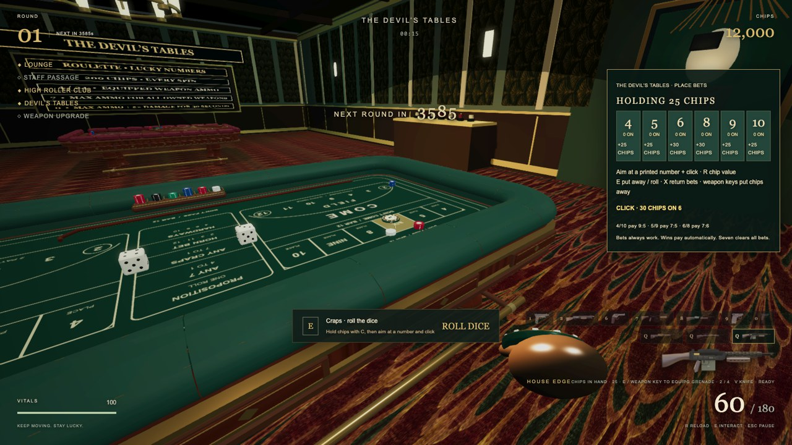
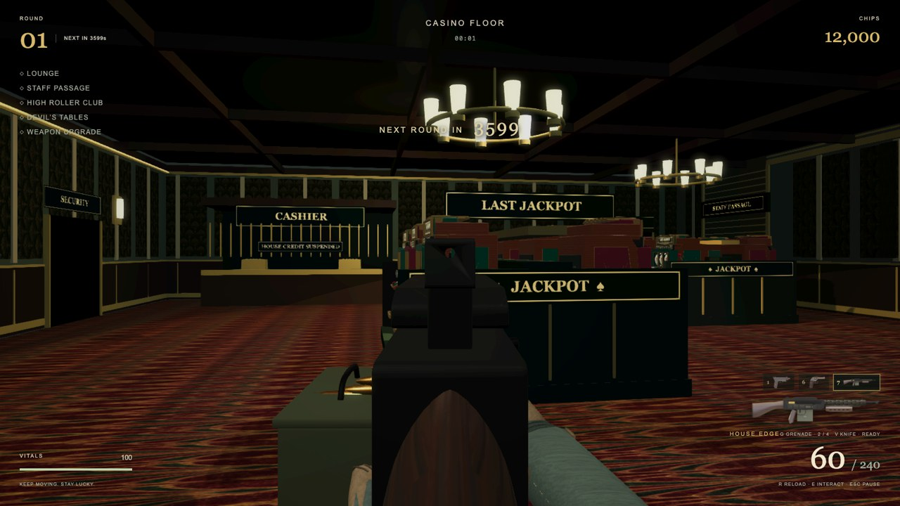
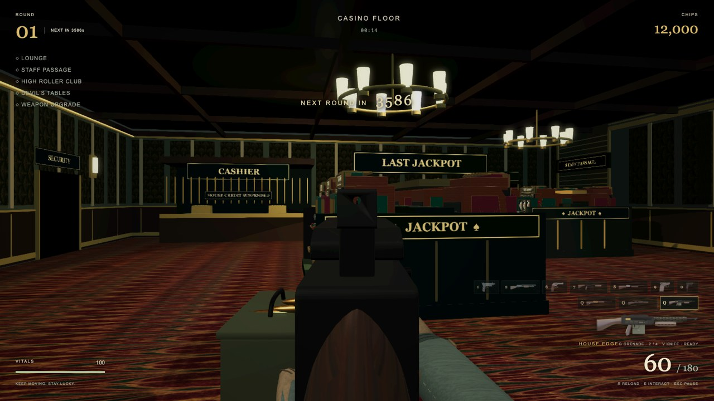
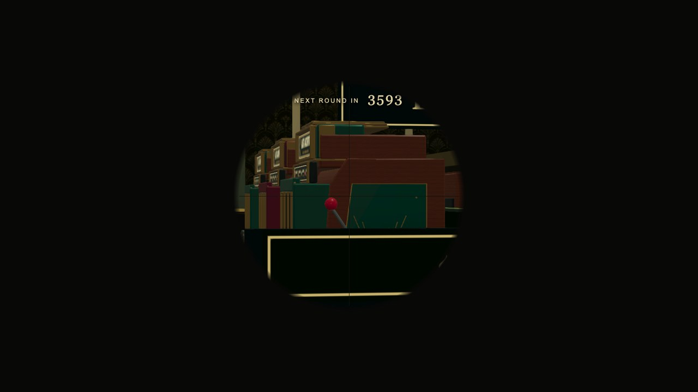

# Arsenal completion review — 28 September 2026

Reviewed the recently merged arsenal and completed the handling, asset and audio gaps. The roster remains ten Mystery Box firearms (including House Edge LMG), Stickman beside the craps table, and the Fire Exit axe. The detailed design contract is [weapon-spec-1970s.md](../weapon-spec-1970s.md).

## Completed

- Replaced Stickman's inaccurate metal rake with a curved lacquered cane hook in its Blender source, GLB, studio renders and HUD art. Its third successful crowd hit breaks the hook; misses do not spend durability. Sound uses cane creak, wood thuds and fibrous breakage.
- Raised conventional sight bases on Chicago Typewriter, Enforcer, Silver Dollar and House Edge to clear their actions. Calibrated the house shotgun's rear sight in Blender. All ranged weapons now support RMB aiming; the sniper has a plain fixed optical view. B preserves the double-barrel alternate shot.
- Smoothed reload recovery and cleared interrupted shell-reload completion state. Restored missing lever and auto-shotgun reload sounds, removed an undefined action cue, and fixed the silent stick-break event. Added fallback playback and cache retry; pause/reset/disposal stop pending sounds.
- Removed the raised craps betting overlay. Target detection, highlight, ghost chips and placed stacks use the actual printed felt and either number bank. C equips chips; E and weapon selection release them, including reselecting the current gun.

## Evidence

- 167 automated tests passed; TypeScript, ESLint and production build passed. Build emitted vinext dynamic-import/static-route-classification notices.
- `check_sights.mjs` passed clear forward-ray checks on all 14 iron/bead sight views. Unit tests also project front/rear anchors onto the camera center.
- `review-handling.json` drove actual WebGL browser captures of nine aimed weapons, LMG reload and completion, printed-felt betting, and E/current-weapon/digit switching. LMG completion restored 60 rounds.
- Blender 5.2 LTS reopened all 13 manifest sources, checked finite mesh coordinates, required animated nodes and texture availability. Results: [blender-source-audit.json](blender-source-audit.json).
- All 94 original WAV cues are packed into the [editable Blender sound audition](../../assets/source/weapons-1970s/weapon-sound-audition.blend). [Listen to the short review mix](weapon-sound-showcase.wav); [cue timing](sound-showcase-cues.json). Sound synthesis is Python-based; Blender handles native geometry and sequencer audition.

## Remaining artistic limits

These are fictional period-inspired designs, not museum replicas. Hands remain rigid baked meshes animated as whole grips, rather than finger-level skeletal animation. Sound files have level/format and runtime timing validation; an in-game listening pass is still needed to judge the mix by ear.
